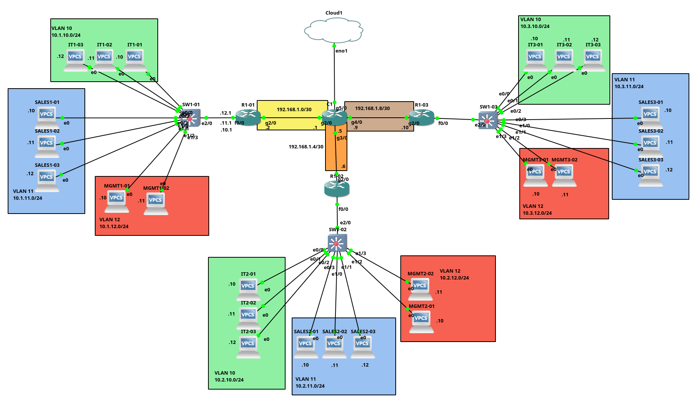

# Multi-Office VLAN Network Design ProjecT  


## Project Overview

This project demonstrates a scalable, secure multi-site network infrastructure for a company with three geographically distributed offices. Each office contains Sales, IT, and Management departments with proper VLAN segmentation, inter-VLAN routing, and site-to-site connectivity.

---

## Network Topology
  

```
[Internet] --- [Core Router]
                    |
      +-------------+-------------+
      |             |             |
   [R1-O1]       [R1-O2]       [R1-O3]
      |             |             |
   [SW1-O1]      [SW1-O2]      [SW1-O3]
      |             |             |
   VLAN 10      VLAN 10       VLAN 10  (IT)
   VLAN 11      VLAN 11       VLAN 11  (Sales)
   VLAN 12      VLAN 12       VLAN 12  (Management)
```

---

## IP Addressing Scheme

### Office 1 (Headquarters - Montreal)
| VLAN | Department | Network | Gateway | DHCP Pool |
|------|------------|---------|---------|-----------|
| 10 | IT | 10.1.10.0/24 | 10.1.10.1 | 10.1.10.10-100 |
| 11 | Sales | 10.1.11.0/24 | 10.1.11.1 | 10.1.11.10-100 |
| 12 | Management | 10.1.12.0/24 | 10.1.12.1 | 10.1.12.10-50 |
| 99 | Native (unused) | - | - | - |

### Office 2 (Branch - Toronto)
| VLAN | Department | Network | Gateway | DHCP Pool |
|------|------------|---------|---------|-----------|
| 10 | IT | 10.2.10.0/24 | 10.2.10.1 | 10.2.10.10-100 |
| 11 | Sales | 10.2.11.0/24 | 10.2.11.1 | 10.2.11.10-100 |
| 12 | Management | 10.2.12.0/24 | 10.2.12.1 | 10.2.12.10-50 |
| 99 | Native (unused) | - | - | - |

### Office 3 (Branch - Vancouver)
| VLAN | Department | Network | Gateway | DHCP Pool |
|------|------------|---------|---------|-----------|
| 10 | IT | 10.3.10.0/24 | 10.3.10.1 | 10.3.10.10-100 |
| 11 | Sales | 10.3.11.0/24 | 10.3.11.1 | 10.3.11.10-100 |
| 12 | Management | 10.3.12.0/24 | 10.3.12.1 | 10.3.12.10-50 |
| 99 | Native (unused) | - | - | - |

### WAN Links
- Office 1 to Core: 192.168.1.0/30
- Office 2 to Core: 192.168.1.4/30
- Office 3 to Core: 192.168.1.8/30

---

## Configuration Guide

### 1. Switch Configuration (Example: Office 1)

```cisco
! Basic configuration
enable
version 15.1
service timestamps debug datetime msec
service timestamps log datetime msec
no service password-encryption
service compress-config
!
hostname SW1-01
!
boot-start-marker
boot-end-marker
!
!
logging discriminator EXCESS severity drops 6 msg-body drops EXCESSCOLL 
logging buffered 50000
logging console discriminator EXCESS
enable secret 4 ZIURQH3mmMhCj6KhSz1JoEv/N.2O6Kl1Wu34klg3hjQ
!
username lgem secret 4 ZIURQH3mmMhCj6KhSz1JoEv/N.2O6Kl1Wu34klg3hjQ
no aaa new-model
clock timezone EST -5 0
no ipv6 cef
ipv6 multicast rpf use-bgp
no ip icmp rate-limit unreachable
!
no ip domain-lookup
ip domain-name lgemprojectccna.com
no ip cef
!
!
!
!
spanning-tree mode pvst
spanning-tree extend system-id
!
!
!
!
vlan internal allocation policy ascending
!
ip tcp synwait-time 5
ip ssh version 2
!         
!
!
!
!
!
!
!
!
interface Ethernet0/0
 description IT Departement
 switchport access vlan 10
 switchport mode access
 switchport port-security
 switchport port-security mac-address sticky
 switchport port-security mac-address sticky 0050.7966.6800
 duplex auto
 spanning-tree portfast
!
interface Ethernet0/1
 description IT Departement
 switchport access vlan 10
 switchport mode access
 switchport port-security
 switchport port-security mac-address sticky
 switchport port-security mac-address sticky 0050.7966.6801
 duplex auto
 spanning-tree portfast
!
interface Ethernet0/2
 description IT Departement
 switchport access vlan 10
 switchport mode access
 switchport port-security
 switchport port-security mac-address sticky
 switchport port-security mac-address sticky 0050.7966.6802
 duplex auto
 spanning-tree portfast
!
interface Ethernet0/3
 description Sales Departement
 switchport access vlan 11
 switchport mode access
 switchport port-security
 switchport port-security mac-address sticky
 switchport port-security mac-address sticky 0050.7966.6803
 duplex auto
 spanning-tree portfast
!
interface Ethernet1/0
 description Sales Departement
 switchport access vlan 11
 switchport mode access
 switchport port-security
 switchport port-security mac-address sticky
 switchport port-security mac-address sticky 0050.7966.6804
 duplex auto
 spanning-tree portfast
!
interface Ethernet1/1
 description Sales Departement
 switchport access vlan 11
 switchport mode access
 switchport port-security
 switchport port-security mac-address sticky
 switchport port-security mac-address sticky 0050.7966.6805
 duplex auto
 spanning-tree portfast
!
interface Ethernet1/2
 description Management
 switchport access vlan 12
 switchport mode access
 switchport port-security
 switchport port-security mac-address sticky
 switchport port-security mac-address sticky 0050.7966.6806
 duplex auto
 spanning-tree portfast
!
interface Ethernet1/3
 description Management
 switchport access vlan 12
 switchport mode access
 switchport port-security
 switchport port-security mac-address sticky
 switchport port-security mac-address sticky 0050.7966.6807
 duplex auto
 spanning-tree portfast
!
interface Ethernet2/0
 description Trunk to R1-01
 switchport trunk encapsulation dot1q
 switchport trunk native vlan 99
 switchport trunk allowed vlan 10-12
 switchport mode trunk
!
interface Ethernet2/1
 duplex auto
!
interface Ethernet2/2
 duplex auto
!
interface Ethernet2/3
 duplex auto
!
interface Ethernet3/0
 duplex auto
!
interface Ethernet3/1
 duplex auto
!
interface Ethernet3/2
 duplex auto
!
interface Ethernet3/3
 duplex auto
!
interface Vlan12
 ip address 10.1.12.2 255.255.255.0
!
ip default-gateway 10.1.10.1
!
no ip http server
!
!
!
!
!
control-plane
!
!
line con 0
 exec-timeout 0 0
 privilege level 15
 logging synchronous
line aux 0
 exec-timeout 0 0
 privilege level 15
 logging synchronous
line vty 0 4
 logging synchronous
 login local
 transport input ssh
!
end
write memory
```

### 2. Router Configuration (Example: Office 1 - Router-on-a-Stick)

```cisco
! Basic configuration
enable
configure terminal
service timestamps debug datetime msec
service timestamps log datetime msec
!
hostname R1-01
!
boot-start-marker
boot-end-marker
!
!
enable secret 4 ZIURQH3mmMhCj6KhSz1JoEv/N.2O6Kl1Wu34klg3hjQ
!
no aaa new-model
no ip icmp rate-limit unreachable
!
!
!
ip dhcp excluded-address 10.1.10.1 10.1.10.9
ip dhcp excluded-address 10.1.11.1 10.1.11.9
ip dhcp excluded-address 10.1.12.1 10.1.12.9
!         
ip dhcp pool Office-1-IT
 network 10.1.10.0 255.255.255.0
 default-router 10.1.10.1 
 domain-name lgemprojectccna.com
!
ip dhcp pool Office-1-Sales
 network 10.1.11.0 255.255.255.0
 default-router 10.1.11.1 
 domain-name lgemprojectccna.com
!
ip dhcp pool Office-1-Management
 network 10.1.12.0 255.255.255.0
 default-router 10.1.12.1 
 domain-name lgemprojectccna.com
!
!
!
no ip domain lookup
ip domain name lgemprojectccna.com
ip cef
no ipv6 cef
!
!         
multilink bundle-name authenticated
!
!
!
!
!
!
!
username lgem secret 4 ZIURQH3mmMhCj6KhSz1JoEv/N.2O6Kl1Wu34klg3hjQ
!
!
!
!
!
ip tcp synwait-time 5
ip ssh version 2
! 
!
!
!
!
!
!         
!
!
interface Loopback0
 ip address 10.1.0.1 255.255.255.255
 ip ospf 1 area 0
!
interface FastEthernet0/0
 description Trunk to SW1
 no ip address
 duplex full
!
interface FastEthernet0/0.10
 description IT VLAN
 encapsulation dot1Q 10
 ip address 10.1.10.1 255.255.255.0
!
interface FastEthernet0/0.11
 description Sales VLAN
 encapsulation dot1Q 11
 ip address 10.1.11.1 255.255.255.0
 ip access-group SALES-ACL in
!
interface FastEthernet0/0.12
 description Management VLAN
 encapsulation dot1Q 12
 ip address 10.1.12.1 255.255.255.0
 ip access-group 1 out
!
interface FastEthernet0/0.99
 description Native VLAN
!
interface FastEthernet1/0
 no ip address
 shutdown
 speed auto
 duplex auto
!
interface FastEthernet1/1
 no ip address
 shutdown
 speed auto
 duplex auto
!
interface GigabitEthernet2/0
 description WAN to Core Router
 ip address 192.168.1.2 255.255.255.252
 negotiation auto
!
router ospf 1
 passive-interface FastEthernet0/0
 passive-interface FastEthernet0/0.10
 passive-interface FastEthernet0/0.11
 passive-interface FastEthernet0/0.12
 passive-interface Loopback0
 network 10.1.10.0 0.0.0.255 area 0
 network 10.1.11.0 0.0.0.255 area 0
 network 10.1.12.0 0.0.0.255 area 0
 network 192.168.1.0 0.0.0.3 area 0
!
ip forward-protocol nd
!
!
no ip http server
no ip http secure-server
!
ip access-list extended SALES-ACL
 deny   ip 10.1.11.0 0.0.0.255 10.1.12.0 0.0.0.255
 permit ip any any
!         
access-list 1 deny   10.1.11.0 0.0.0.255
access-list 1 permit any
!
!
!
control-plane
!
!
line con 0
 exec-timeout 0 0
 privilege level 15
 password baskettd2
 logging synchronous
 login
line aux 0
 exec-timeout 0 0
 privilege level 15
 logging synchronous
line vty 0 4
 logging synchronous
 login local
 transport input ssh
!
!
end
write memory
```

### 3. Access Control Lists (ACLs)

```cisco
! ACL to restrict Management VLAN access
! Management can access all networks
! Sales department cannot access Management

configure terminal

! Deny Sales from accessing Management
ip access-list extended SALES-ACL
  deny ip 10.1.11.0 0.0.0.255 10.1.12.0 0.0.0.255
  permit ip any any
exit

! Apply ACL to Sales VLAN interface
interface FastEthernet0/0.11
  ip access-group SALES-ACL in
exit

end
write memory
```

### 4. Core Router Configuration

```cisco
enable
configure terminal
service timestamps debug datetime msec
service timestamps log datetime msec
!
hostname C1
!
boot-start-marker
boot-end-marker
!
!
enable secret 4 ZIURQH3mmMhCj6KhSz1JoEv/N.2O6Kl1Wu34klg3hjQ
!
no aaa new-model
no ip icmp rate-limit unreachable
!
!
!
!
!
!
no ip domain lookup
ip domain name lgemprojectccna.com
ip cef
no ipv6 cef
!
!
multilink bundle-name authenticated
!
!
!
!
!
!
!
username lgem secret 4 ZIURQH3mmMhCj6KhSz1JoEv/N.2O6Kl1Wu34klg3hjQ
!
!
!
!
!
ip tcp synwait-time 5
ip ssh version 2
! 
!         
!
!
!
!
!
!
!
interface Loopback0
 ip address 10.0.0.1 255.255.255.255
 ip ospf 1 area 0
!
interface FastEthernet0/0
 no ip address
 shutdown
 duplex full
!
interface FastEthernet1/0
 no ip address
 shutdown
 speed auto
 duplex auto
!
interface FastEthernet1/1
 no ip address
 shutdown
 speed auto
 duplex auto
!
interface GigabitEthernet2/0
 ip address 192.168.1.1 255.255.255.252
 negotiation auto
!
interface GigabitEthernet3/0
 ip address 192.168.1.5 255.255.255.252
 negotiation auto
!
interface GigabitEthernet4/0
 ip address 192.168.1.9 255.255.255.252
 negotiation auto
!
interface GigabitEthernet5/0
 no ip address
 negotiation auto
!
router ospf 1
 passive-interface GigabitEthernet5/0
 passive-interface Loopback0
 network 192.168.1.0 0.0.0.255 area 0
 default-information originate
!
ip forward-protocol nd
!
!
no ip http server
no ip http secure-server
ip route 0.0.0.0 0.0.0.0 GigabitEthernet5/0
!
!
!
!
control-plane
!
!
line con 0
 exec-timeout 0 0
 privilege level 15
 logging synchronous
 stopbits 1
line aux 0
 exec-timeout 0 0
 privilege level 15
 logging synchronous
 stopbits 1
line vty 0 4
 logging synchronous
 login local
 transport input ssh
!
!
end
write memory
```

---

## Security Implementation

### Port Security (Switch Configuration)

```cisco
! Apply to access ports
interface range Ethernet0/1-24
  switchport port-security
  switchport port-security maximum 1
  switchport port-security mac-address sticky
exit
```

### SSH Configuration

```cisco
! On all routers and switches
configure terminal
ip domain-name lgemprojectccna.com
crypto key generate rsa modulus 2048
username lgem privilege 15 secret Admin@123

line vty 0 4
  transport input ssh
  login local
exit

ip ssh version 2
ip ssh time-out 60
ip ssh authentication-retries 3
end
write memory
```

---

## Testing & Verification Commands

### Connectivity Testing
```cisco
! Verify VLAN configuration
show vlan brief
show interfaces trunk

! Verify routing
show ip route
show ip ospf neighbor
show ip interface brief

! Verify DHCP
show ip dhcp binding
show ip dhcp pool

! Verify ACLs
show access-lists
show ip access-lists

! Test connectivity
ping 10.2.10.1
ping 10.3.10.1
traceroute 10.2.11.10
```

### Expected Results
- Devices in same department across offices can communicate (e.g., IT Office 1 ↔ IT Office 2)
- Sales cannot access Management VLANs
- IT can access all departments
- Management can access all departments
- All offices can reach each other via OSPF routing

---

## Network Security Features

1. **VLAN Segmentation** - Logical separation of departments
2. **Access Control Lists** - Restrict unauthorized access
3. **Port Security** - Prevent MAC flooding attacks
4. **Native VLAN** - Configured to unused VLAN 99
5. **SSH Access** - Encrypted management access
6. **DHCP Snooping** - (Optional) Prevent rogue DHCP servers
7. **Dynamic ARP Inspection** - (Optional) Prevent ARP spoofing

---

## Scalability Considerations

This design supports:
- Easy addition of new offices (just add new VLAN ranges)
- Growth within departments (subnets allow 250+ hosts each)
- Additional VLANs for new departments
- Layer 3 switches for improved performance (future upgrade)
- Redundant links and HSRP/VRRP for high availability

---

## Conclusion

This project demonstrates a production-ready network design suitable for a multi-site enterprise environment. The implementation showcases core CCNA concepts including VLANs, routing, security, and scalability while following Cisco best practices.

**Created by:** Loic Elombat   
**Date:** December 2025  
